<!-- PROJECT SHIELDS -->

[![Contributors][contributors-shield]][contributors-url]
[![Forks][forks-shield]][forks-url]
[![Stargazers][stars-shield]][stars-url]
[![Issues][issues-shield]][issues-url]
[![MIT License][license-shield]][license-url]

<!-- PROJECT LOGO -->
 

  <a href="https://github.com/harrisb002/Hyperspectral-Landcover-Classification">
    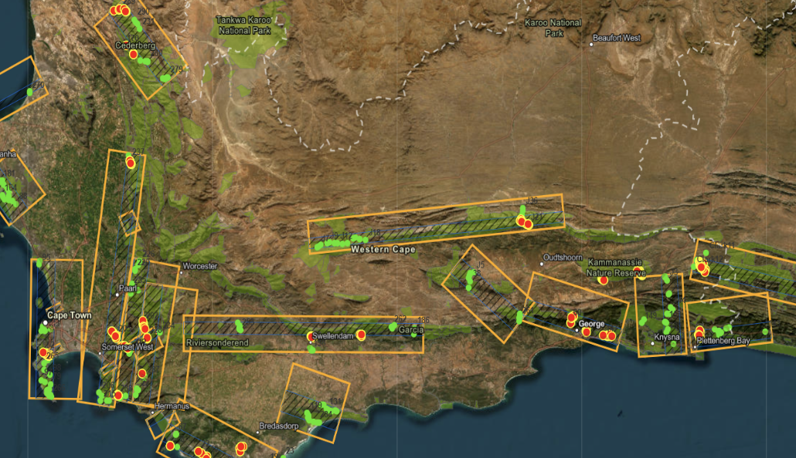
  </a>
   
  
  <a href="https://github.com/harrisb002/Hyperspectral-Landcover-Classification">
    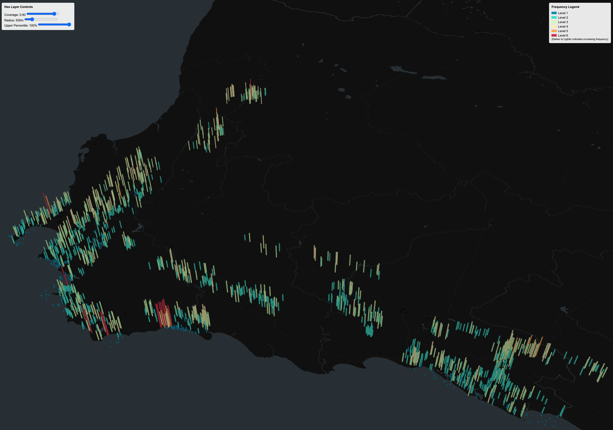
  </a>

<h3 align="center">Hyperspectral Landcover Classification</h3>

  

    A Computer Vision Model For Classifying Terrain  
     
    <a href="#detailed-analysis-and-results"><strong>Explore the Docs »</strong></a>
     
     
    <a href="https://github.com/harrisb002/cs375/blob/main/Final-Project/hsi-visualization/README.md"><strong>Explore the Web-Based App »</strong></a>
  

#### 🎥 Project Overview Video

[**Project Video**](https://www.youtube.com/watch?v=d1GeVBbj67I)

#### 📓 Project Presentation

[**Presentation (PDF)**](Assets/FinalDeliverablePresentation.pdf)

---

<!-- TABLE OF CONTENTS -->

  
Table of Contents

  <ol>
    <li><a href="#about-the-project">About The Project</a></li>
    <li><a href="#getting-started">Getting Started</a>
      <ul>
        <li><a href="#running-the-program">Running The Program</a></li>
      </ul>
    </li>
    <li><a href="#roadmap">Roadmap</a></li>
    <li><a href="#usage">Usage</a></li>
    <li><a href="#contributors">Contributors</a></li>
    <li><a href="#connect-with-us">Connect</a></li>
    <li><a href="#license">License</a></li>
    <li><a href="docs">Detailed Analysis and Results</a></li>
  </ol>

---

<!-- ABOUT THE PROJECT -->

## About The Project

### A Larger Initiative: BioSCape

This project is part of the larger **BioSCape** initiative, a collaboration aimed at understanding biodiversity in the Greater Cape Floristic Region of South Africa. It utilizes **hyperspectral images** captured by the NASA‐SANSA AVIRIS-NG remote sensor to classify land cover types across diverse ecological categories.

Learn more about [BioSCape](https://www.bioscape.io/).

- **Biodiversity Survey of the Cape**: A NASA-SANSA research project focusing on hyperspectral data of the Greater Cape Floristic Region.
- **Sensor**: AVIRIS-NG capturing 432 frequency bands per pixel, enabling detailed classification (**Should be noted only 373 bands using a range of 4-7m resolution**).

### Land Cover Classification Categories

1. **Annual Crops**
2. **Built-up** (urban/man-made structures)
3. **Consolidated Barren** (rocks, salt pans, etc.)
4. **Natural Grassland**
5. **Natural Wooded Land**
6. **Permanent Crops** (vineyards, orchards)
7. **Planted Forest**
8. **Shrubs**
9. **Unconsolidated Barren** (loose soil, beaches)
10. **Waterbodies**
11. **Wetlands**

---

## Contributors

  
  
  
  
  

- **Ben Harris** - [LinkedIn](https://www.linkedin.com/in/benjamin-harris-388151274/)
- **Sam Hobbs** - [LinkedIn](https://www.linkedin.com/in/samuel-hobbs-234204183/)
- **Blake Marshall** - [LinkedIn](https://www.linkedin.com/in/blakemarshalll)
- **Jacob Sellers** - [LinkedIn](https://www.linkedin.com/in/jacob-sellers-83840826a/)
- **Sean Farmer** - [LinkedIn](https://www.linkedin.com/in/sean-farmer-517ab8276/)
- **Ian Swallow** - [LinkedIn](https://www.linkedin.com/in/ian-swallow-b37266311/)
- **Collins Senaya** - [LinkedIn](https://www.linkedin.com/in/collins-senaya-044ba51bb/)
- **Isauro Ramos** - [LinkedIn](https://www.linkedin.com/in/ramosisauro/)

---

## Docs

This section provides an **in-depth** overview of how hyperspectral data were handled, the **outlier detection** process, the **CNN implementation**, and key **results and metrics**. It concludes with a discussion of performance, challenges, and future directions.

---

### 1. Dataset & Distribution

We gathered pixel‐level samples from AVIRIS-NG images in the Greater Cape Floristic Region, labeling each pixel according to its terrain class. Below is a snapshot of the **overall distribution** (count of **samples**/scenes) across our classes:

  
<strong>Initial Label Counts (Pixel-Level)</strong>

- Shrubs: 670
- Annual Crops: 298
- Waterbodies: 239
- Natural Wooded Land: 192
- Planted Forest: 171
- Permanent Crops: 153
- Natural Grassland: 123
- Built-up: 125
- Wetlands: 112
- Consolidated Barren: 105
- Unconsolidated Barren: 89
- Mixed or Not Classified: 145

For training–testing splits, ensured **stratification** at the sample (image) level:

- **Training** split (80% of image samples):
- **Testing** split (20% of image samples):

**Data Imbalance:** Some classes (e.g., **Shrubs** ) have substantially more samples than others (e.g., **Unconsolidated Barren**). This imbalance impacted model training, especially for lower‐frequency classes such as **Wetlands** or **Consolidated Barren**.

---

### 2. Preprocessing & Outlier Removal

Our preprocessing pipeline focused on **data cleaning** and **outlier detection** to remove “noisy” or invalid pixels before model training.

#### 2.1 Data Cleaning

1. **Remove “Mixed or Not Classified” Labels**  
   Rows with ambiguous or unreliable class designations were discarded.

2. **Handle Missing Frequency Data**

   - Any pixel with missing reflectance values in the 373 hyperspectral bands was removed.

3. **One-Hot / Encoded Labels**
   - Class names were stored as integer encodings for downstream processing and model training/testing.

#### 2.2 PCA‐Based Outlier Detection

Employed a **PCA + Mahalanobis distance** approach per image sample:

1. **Scaling** via a **RobustScaler** (reduces sensitivity to outliers).
2. **Principal Component Analysis** retaining **95%** of variance to compress high-dimensional reflectance data.
3. **Mahalanobis Distance** in PCA space to flag points exceeding a chi-square threshold (e.g., \(\alpha=0.05\)).
4. Pixels classified as outliers were removed from the dataset.

Below are **visual examples** showing removed outlier pixels in **black**:

  
  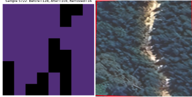
  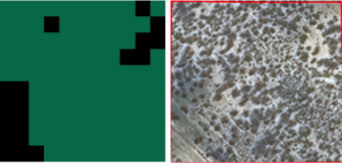

> **Figure**: **Shown in order from left to right**, Example outlier removal for three different samples.
>
> - **Sample 7981**: Before=308 pixels, After=283, Removed=21
> - **Sample 5722**: Before=128 pixels, After=108, Removed=16
> - **Sample 30**: Before=110 pixels, After=92, Removed=18

This process **helped reduce** noisy signals and improved overall classification consistency.

---

### 2. Morphological Post-Processing

Although the 1D CNN provides detailed **per-pixel** classifications, small patches of noise or isolated mislabeled pixels can appear. To mitigate this, **dilation‐based** morphological filter **only** to the majority class in each image is applied. This helps smooth out noise while **minimally affecting overall image predictions**.

1. **Majority-Class Detection**  
   Each image is analyzed to find the most frequent label.

2. **Targeted Dilation**  
   We **dilate only the majority-class regions** using a small \(3 \times 3\) structuring element. Surrounding pixels become assigned to that majority class if they fall within the dilated mask.

3. **Per-Pixel vs. Per-Image Effect**
   - **Per-Pixel**: Accuracy can improve due to the removal of spurious outliers which are absorbed by the dominant class.
   - **Per-Image**: Because majority voting already often selects the dominant label, **the final image-level classification is not significantly impacted**.

#### Example Outputs

Below are three examples illustrating the **original CNN predictions** (_left_) vs. **post‐morphology** (_right_). Note how small, disjoint misclassifications within large homogeneous regions are eliminated:

  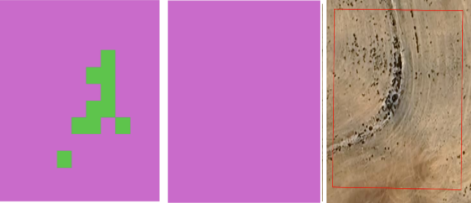
  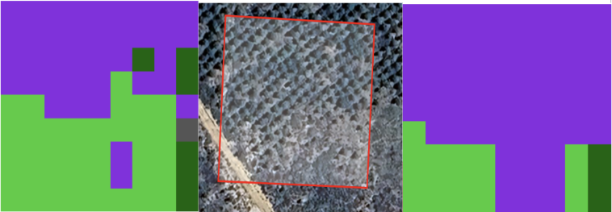
  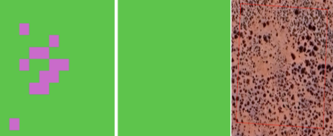

> **Figure**: Post-processing visually “cleans” each labeled map by expanding the majority class (green in these examples), removing small scattered patches of confusion.

In practice, morphological post-processing is **optional** and can be tuned via alternative structuring elements (e.g., disk, diamond), operation types (e.g., opening/closing), or window sizes. For our dataset, we found **minimal changes** in **image-level** metrics, but **reduced noise** at the **per-pixel** scale.

---

### 3. 1D CNN Implementation

Built a **1D Convolutional Neural Network** to leverage the **spectral dimension** (373 channels) for classification:

  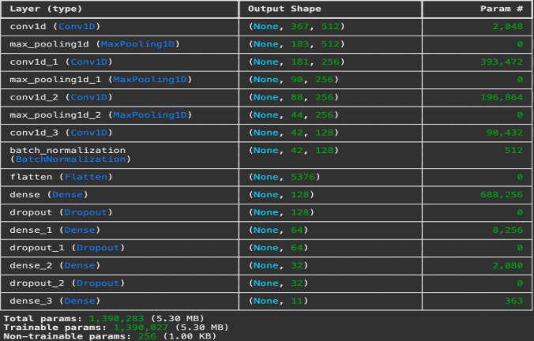

> **Figure**: 1D CNN Architecture

#### Key Model Details

- **Input Shape**: \((\text{# of frequency bands}, 1)\)
- **Layers**:
  - 4 × Conv1D layers (512 → 256 → 256 → 128 filters), with **ReLU** activation
  - **MaxPooling1D** layers after each convolution for dimension reduction
  - **Batch Normalization** to stabilize and speed up training
  - Several **Dense** layers (128 → 64 → 32) with **Dropout** to mitigate overfitting
  - **Output**: Dense layer with **softmax** for multi-class classification
- **Optimizer**: **Adam** (init. learning rate = .0001)
- **Loss Function**: **Categorical Crossentropy**
- **Callbacks**: EarlyStopping, ReduceLROnPlateau, ModelCheckpoint

---

### 4. Results & Discussion

We evaluated performance at the **image level**, i.e., each test image’s class assigned via majority voting on pixel predictions.

#### 4.1 Retaining “Shrubs” and “Natural Grassland” as Separate Classes

When **Shrubs** and **Natural Grassland** remain **distinct**:

  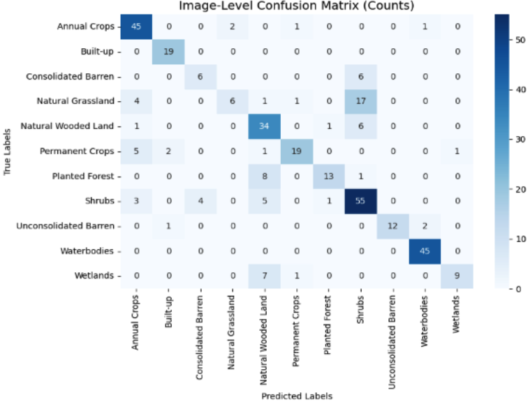

> **Figure**: Image-Level Confusion Matrix (Counts) — _Shrubs_ and _Natural Grassland_ kept separate

  
<strong>Classification Report (Dropdown)</strong>

| Class                 | Precision | Recall | F1-Score |
| --------------------- | --------: | -----: | -------: |
| Annual Crops          |      0.78 |   0.92 |     0.84 |
| Built-up              |      0.86 |   1.00 |     0.93 |
| Consolidated Barren   |      0.68 |   0.55 |     0.61 |
| Natural Grassland     |      0.75 |   0.21 |     0.32 |
| Natural Wooded Land   |      0.61 |   0.69 |     0.65 |
| Permanent Crops       |      0.86 |   0.58 |     0.70 |
| Planted Forest        |      0.77 |   0.65 |     0.70 |
| **Shrubs**            |      0.65 |   0.81 |     0.72 |
| Unconsolidated Barren |      0.80 |   0.70 |     0.74 |
| Waterbodies           |      0.94 |   1.00 |     0.97 |
| Wetlands              |      0.75 |   0.35 |     0.48 |

**Overall Image‐Level Accuracy**: **78%**

- Classes like **Built‐up** and **Waterbodies** achieve near‐perfect recall.
- **Shrubs** and **Natural Grassland** see **significant confusion**, hurting recall for Grassland.
- **Wetlands** and **Consolidated Barren** also struggle.

#### 4.2 Merging “Shrubs” and “Natural Grassland” into a Single Class

To reduce confusion between these visually/spectrally similar categories, we merged them into one label: **“Shrubs and Natural Grassland.”**

  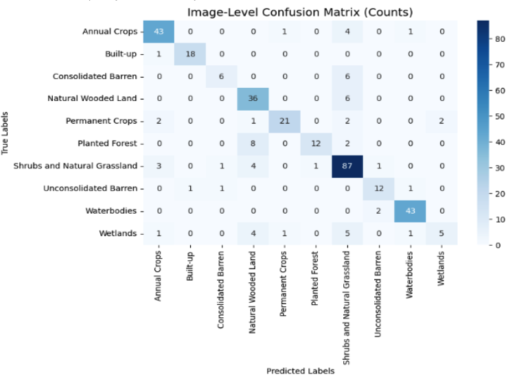

> **Figure**: Image-Level Confusion Matrix (Counts) — _Shrubs & Natural Grassland_ merged

  
<strong>Classification Report (Dropdown)</strong>

| Class                            | Precision | Recall | F1-Score |
| -------------------------------- | --------: | -----: | -------: |
| Annual Crops                     |      0.86 |   0.90 |     0.88 |
| Built-up                         |      0.90 |   1.00 |     0.95 |
| Consolidated Barren              |      0.75 |   0.50 |     0.60 |
| Natural Wooded Land              |      0.70 |   0.83 |     0.76 |
| Permanent Crops                  |      0.86 |   0.68 |     0.76 |
| Planted Forest                   |      0.81 |   0.59 |     0.68 |
| **Shrubs and Natural Grassland** |      0.79 |   0.89 |     0.83 |
| Unconsolidated Barren            |      0.80 |   0.67 |     0.73 |
| Waterbodies                      |      0.93 |   0.96 |     0.95 |
| Wetlands                         |      0.75 |   0.35 |     0.48 |

**Overall Image‐Level Accuracy**: **82%**

- Merging significantly **boosted** accuracy and **F1** for that combined class.
- **Built‐up** and **Waterbodies** remain strong, with near‐perfect scores.
- Challenges persist for **Wetlands** and **Consolidated Barren**.

---

### 5. Key Takeaways & Limitations

1. **Outlier Removal Helps**
   - PCA+Mahalanobis filtering prunes noisy spectral pixels, improving class separation.
2. **Merging Similar Classes**
   - Combining **Shrubs** and **Natural Grassland** alleviated confusion, yielding an **82%** image‐level accuracy.
3. **Data Imbalance Issues**
   - Classes like **Wetlands**, **Unconsolidated Barren**, etc., remain underrepresented, hurting recall and F1. Techniques like oversampling or advanced class weighting could further help.
4. **Spectral Complexity**
   - Hyperspectral data benefits from 1D CNN approaches but **visually similar** or **spectrally close** classes remain difficult to discriminate.

---

## Hyperspectral Land Cover Classification Visualization App

### Geospatial Visualization with Google Maps

The platform uses the Google Maps API for an intuitive spatial interface:

- **Marker-based Visualization:**  
   Classified sample points are displayed as markers on a satellite basemap. Green markers indicate
  correctly predicted labels (based on ground truth), while red markers indicate discrepancies.

  **Example (Marker Map with Predictions):**
    

    
  

- **Category-Based Filtering:**  
  A sidebar allows users to filter land cover samples by category. Choosing a category (e.g., "Shrubs and Natural Grassland")
  highlights only those samples, making pattern recognition straightforward.

- **Interactive Info Windows:**  
  Clicking a marker displays detailed metadata: sample number, ground truth label, predicted label,
  and options to add the sample to further analytical plots (e.g., scatter or bar plots).

    

    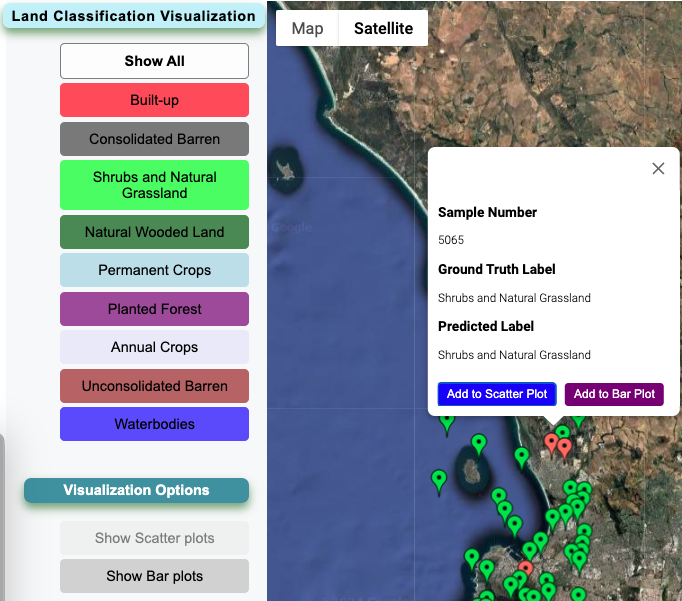
  

### Hexagon Layer Visualization

Beyond simple markers, the tool can display aggregated frequency data using a hexagonal binning layer powered by [deck.gl](https://deck.gl/):

- **Pre-Aggregated Frequency Sums:**  
  Frequency values from hyperspectral samples are aggregated and stored in a MongoDB backend, enabling quick retrieval of summarized data. This reduces memory load and improves performance.

- **3D Hexagon Layer:**  
  A HexagonLayer renders vertical columns at sample locations, with height and color encoding frequency sums. This provides an immediate sense of spatial distribution and intensity patterns across the landscape.
    

    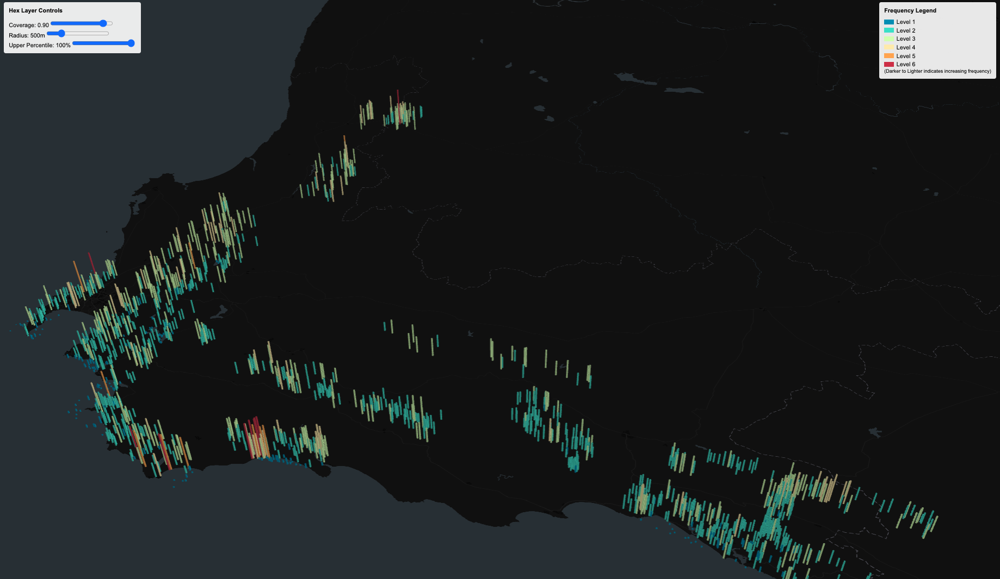
  

- **Adjustable Parameters:**  
  A control panel allows real-time adjustments of coverage, radius, and upper percentile parameters, enabling dynamic exploration of spatial frequency distributions.

### Bar and Scatter Plots for Detailed Analysis

For deeper dives into spectral distributions:

- **Bar Plot:**  
  Users can select individual samples and generate histograms (bar plots) of frequency distributions.

    <a >
    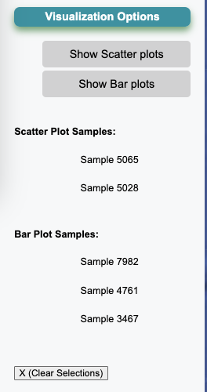
  </a>

  This allows closer inspection of the underlying spectral frequency ranges for a chosen sample, revealing how spectral values cluster within intervals.

  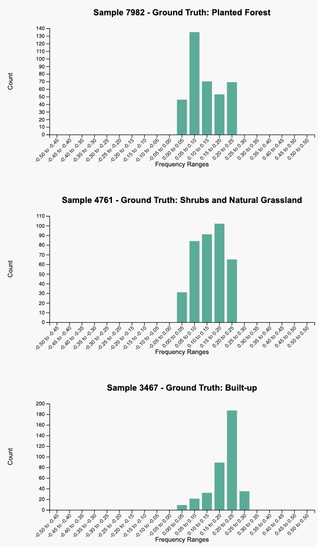

- **Scatter Plot (for Frequencies):**  
  Users can also view scatter plots for selected frequency bands or combinations thereof, helping them identify relationships or anomalies in spectral signatures.

(<a href="#readme-top">back to top</a>)

<!-- MARKDOWN LINK DEFINITIONS -->

[contributors-shield]: https://img.shields.io/github/contributors/harrisb002/Hyperspectral-Landcover-Classification.svg?style=for-the-badge
[contributors-url]: https://github.com/harrisb002/Hyperspectral-Landcover-Classification/graphs/contributors
[forks-shield]: https://img.shields.io/github/forks/harrisb002/Hyperspectral-Landcover-Classification.svg?style=for-the-badge
[forks-url]: https://github.com/harrisb002/Hyperspectral-Landcover-Classification/network/members
[stars-shield]: https://img.shields.io/github/stars/harrisb002/Hyperspectral-Landcover-Classification.svg?style=for-the-badge
[stars-url]: https://github.com/harrisb002/Hyperspectral-Landcover-Classification/stargazers
[issues-shield]: https://img.shields.io/github/issues/harrisb002/Hyperspectral-Landcover-Classification.svg?style=for-the-badge
[issues-url]: https://github.com/harrisb002/Hyperspectral-Landcover-Classification/issues
[license-shield]: https://img.shields.io/github/license/harrisb002/Hyperspectral-Landcover-Classification.svg?style=for-the-badge
[license-url]: https://github.com/harrisb002/Hyperspectral-Landcover-Classification/blob/main/LICENSE.txt

### Thank you for looking into this project!
